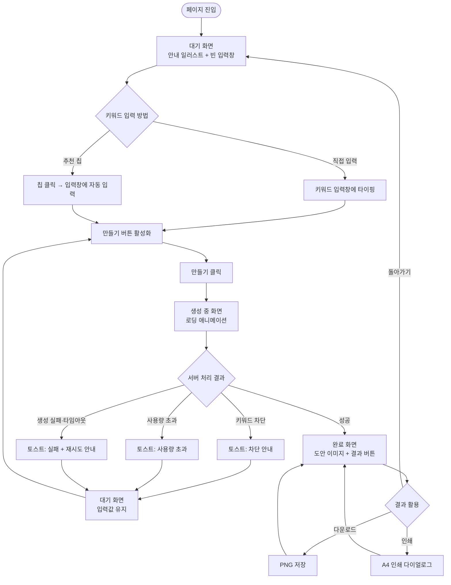
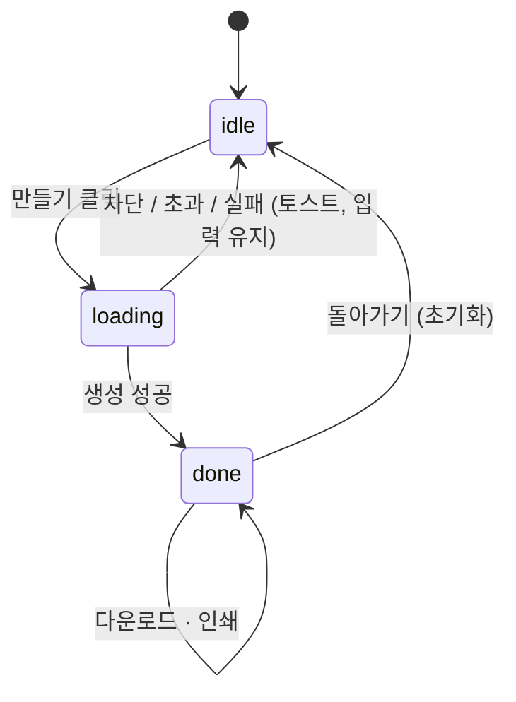

# 유저플로우 — 색칠요정

> 기준 문서: [prd.md](prd.md) v0.4 · 작성일: 2026-09-30
> 범위: 단일 페이지 · 색칠공부 도안 생성 기능

---

## 1. 전체 흐름

## 2. 화면 상태 정의

단일 페이지는 4가지 상태를 오간다.

| 상태 | 캔버스 영역 | 입력창·추천 칩 | 만들기 버튼 | 결과 버튼 |
|---|---|---|---|---|
| **대기 (idle)** | 안내 일러스트 + "무엇을 그려줄까요?" | 활성 | 입력 있으면 활성, 없으면 비활성 | 숨김 |
| **생성 중 (loading)** | 로딩 애니메이션 + "요정이 그리는 중…" | 비활성 | 로딩 표시, 클릭 불가 | 숨김 |
| **완료 (done)** | 생성된 도안 이미지 | 숨김 또는 비활성 | 숨김 | 다운로드 · 인쇄 · 돌아가기 |
| **에러 (error)** | 대기 상태로 복귀 (토스트로 안내) | 활성, **입력값 유지** | 활성 | 숨김 |

> 에러는 별도 화면을 두지 않고 **토스트 + 대기 상태 복귀**로 처리한다. 입력값을 유지해 바로 수정·재시도할 수 있게 한다.

## 3. 단계별 상세

### STEP 1. 진입
- 사용자: 페이지에 들어온다.
- 시스템: 대기 상태 표시. 입력창 placeholder "예: 엄지공주", 아래에 추천 칩 6~8개.

### STEP 2. 키워드 입력
| 경로 | 사용자 행동 | 시스템 반응 |
|---|---|---|
| 직접 입력 | 입력창에 키워드 타이핑 | 1자 이상이면 만들기 버튼 활성화. 30자 초과 입력 불가 |
| 추천 칩 | 칩(예: 공룡) 클릭 | 입력창에 "공룡" 채움 (기존 값은 교체). **바로 생성하지 않음** |

- 공백만 입력 → 버튼 비활성 유지.
- 모바일: Enter(완료) 키로 만들기 실행 가능.

### STEP 3. 생성 요청
- 사용자: [만들기] 클릭.
- 시스템:
  1. 생성 중 상태로 전환 (입력·칩·버튼 잠금, 중복 요청 방지)
  2. 서버에서 사용량 확인 → 키워드 검증(아동용 적합 여부) → 프롬프트 변환 → 이미지 생성 → 흑백 보정
  3. 결과에 따라 STEP 4 또는 예외 흐름(§4)으로 분기

### STEP 4. 결과 확인
- 시스템: 캔버스에 도안 표시(A4 세로 비율), 결과 버튼 3개 노출.
- 사용자: 도안을 보고 다음 행동을 고른다.

### STEP 5. 결과 활용
| 버튼 | 동작 | 이후 상태 |
|---|---|---|
| 다운로드 | PNG 저장 (`색칠요정_{키워드}_{YYYYMMDD}.png`) | 완료 상태 유지 |
| 인쇄 | 브라우저 인쇄 다이얼로그 → 도안만 A4 한 장에 출력 (헤더·버튼 숨김) | 완료 상태 유지 |
| 돌아가기 | 입력값·결과 초기화 | 대기 상태 (STEP 1) |

> 다운로드·인쇄는 여러 번 반복할 수 있다. 새 도안을 만들려면 [돌아가기]를 누른다.

## 4. 예외 흐름

| 상황 | 발생 시점 | 토스트 메시지 (안) | 이후 상태 |
|---|---|---|---|
| 도안과 무관한 키워드 (예: 뉴욕 사진) | 서버 키워드 검증 | "색칠공부에 어울리는 키워드를 입력해 주세요 🙂" | 대기, 입력값 유지 |
| 아동에게 부적절한 키워드 | 서버 키워드 검증 | "요정이 그릴 수 없는 그림이에요. 다른 걸 골라볼까요?" | 대기, 입력값 유지 |
| 사용량 초과 | 서버 사용량 확인 | "오늘은 요정이 쉬는 중이에요. 내일 다시 만나요!" | 대기, 입력값 유지 |
| 생성 실패 / 60초 타임아웃 | 이미지 생성 | "그림을 완성하지 못했어요. 다시 시도해 주세요." | 대기, 입력값 유지 |
| 네트워크 끊김 | 요청 중 | "인터넷 연결을 확인해 주세요." | 대기, 입력값 유지 |

## 5. 엣지 케이스

| 케이스 | 처리 |
|---|---|
| 생성 중 새로고침·이탈 | 요청 취소, 재진입 시 대기 상태 (결과 저장 안 함) |
| 완료 상태에서 새로고침 | 결과 사라짐, 대기 상태 (저장 기능 없음) |
| 브라우저 뒤로가기 | 단일 페이지이므로 이전 사이트로 이동 (상태 히스토리 관리 안 함) |
| 인쇄 취소 | 완료 상태 유지 |
| 모바일 인쇄 미지원 브라우저 | 다운로드 후 사진 앱에서 인쇄하도록 안내 토스트 |
| 한/영 혼합, 이모지 입력 | 허용 (서버 검증에서 판단) |

## 6. 상태 전이 요약

