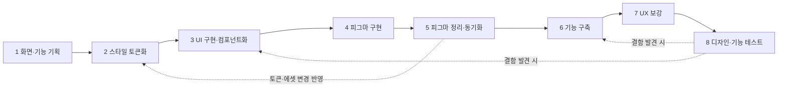

# 워크플로우 — 색칠요정

> 작성일: 2026-09-30
> 목적: 평소 서비스를 만드는 작업 방식을 단계별로 문서화한다. AI 에이전트(Claude Code) 하네스가 이 순서와 완료 기준을 따라 작업하도록 기준을 준다.
> 관련 문서: [prd.md](prd.md) · [userflow.md](userflow.md) · design.md

---

## 1. 전체 흐름

**핵심 원칙**
- **디자인 먼저, 기능은 나중:** 화면(UI)을 먼저 완성하고, 확정된 화면 위에 기능을 붙인다.
- **스타일 토큰이 기준:** 색·폰트·간격 등은 토큰으로만 쓴다. 코드와 피그마 모두 같은 토큰을 바라본다.
- **코드 → 피그마 → 코드 순환:** 코드로 먼저 만든 화면을 피그마에 옮겨 다듬고, 다듬은 결과를 다시 코드에 반영한다.
- **단계마다 완료 기준을 통과해야 다음 단계로 넘어간다.**

## 2. 단계 요약

| # | 단계 | 입력 | 산출물 | 주 도구 |
|---|---|---|---|---|
| 1 | 화면 및 기능 기획 | prd.md | 화면 명세, userflow.md | 문서 |
| 2 | 스타일 토큰화 | design.md | 토큰 파일 (CSS 변수 / Tailwind 설정) | 코드 |
| 3 | UI 화면 구현 · 컴포넌트화 | 화면 명세, 토큰 | 정적 UI 화면, 공통 컴포넌트 | Next.js, Tailwind |
| 4 | 피그마 구현 | 구현된 UI 화면 | 코드와 동일한 피그마 화면 | Figma MCP |
| 5 | 피그마 정리 · 동기화 · 에셋 교체 | 피그마 화면 | 정리된 피그마 파일, 갱신된 토큰·에셋 | Figma, Figma MCP |
| 6 | 기능 구축 | 완성된 UI | 동작하는 서비스 | Next.js API, AI API |
| 7 | 인터랙션 등 UX 보강 | 동작하는 서비스 | 애니메이션·피드백이 더해진 서비스 | CSS, 모션 |
| 8 | 디자인 및 기능 테스트 | 완성된 서비스 | 테스트 결과, 수정 목록 | Vitest, Playwright, 브라우저 |

## 3. 단계별 상세

### STEP 1. PRD를 토대로 화면 및 기능 기획
- **목적:** PRD의 요구사항을 실제 화면 단위와 기능 단위로 쪼갠다.
- **입력:** `prd.md`
- **작업:**
  - 화면 구성 요소와 상태(대기·생성 중·완료·에러) 정의
  - 사용자 흐름, 예외 흐름, 엣지 케이스 정리
  - 기능 목록과 우선순위 정리
- **산출물:** `userflow.md`, 화면 명세 (prd.md §5)
- **완료 기준:** PRD의 목표가 모두 화면이나 기능에 대응되고, 모든 상태의 화면이 정의됨

### STEP 2. design.md를 바탕으로 스타일 토큰화
- **목적:** 디자인 가이드를 코드에서 바로 쓸 수 있는 토큰으로 바꾼다.
- **입력:** `design.md` (무드, 컬러, 타이포그래피, 간격, 모서리, 그림자 등)
- **작업:**
  - 원시 토큰(Primitive)과 의미 토큰(Semantic)으로 나눈다
    - 원시 토큰 예: `color-yellow-400`
    - 의미 토큰 예: `color-primary`, `color-bg-canvas`
  - CSS 변수와 Tailwind 테마에 등록
- **산출물:** 토큰 파일 (`app/globals.css`의 CSS 변수, Tailwind 테마 설정)
- **완료 기준:** design.md의 모든 값이 토큰으로 존재하고, 토큰 이름만 보고 용도를 알 수 있음

### STEP 3. 스타일 토큰을 적용한 UI 화면 구현, 반복 엘리먼트 컴포넌트화
- **목적:** 기능 없이 눈에 보이는 화면을 먼저 완성한다.
- **입력:** 화면 명세, 토큰
- **작업:**
  - 모든 상태 화면을 정적으로 구현 (임시 이미지·더미 데이터 사용)
  - 반복되는 요소(버튼, 칩, 토스트 등)는 필요할 때 컴포넌트로 분리
  - 반응형 확인 (모바일 우선, 세로형 이미지 + 버튼 구조)
- **산출물:** 정적 UI 화면, `components/` 공통 컴포넌트
- **완료 기준:**
  - 하드코딩된 색·크기 값 없이 토큰만 사용
  - 모든 상태 화면을 확인할 수 있음
  - 주요 기기 화면에서 레이아웃이 깨지지 않음

### STEP 4. 해당 화면을 피그마에 MCP로 연결해 똑같이 구현
- **목적:** 코드 화면을 피그마로 옮겨 디자인 작업 공간을 만든다.
- **입력:** STEP 3에서 구현한 UI 화면
- **작업:**
  - Figma MCP 연결 (사전 인증 필요)
  - 토큰을 피그마 변수(Variables)로 등록
  - 컴포넌트를 피그마 컴포넌트로 만들고, 상태별 화면 프레임 구성
- **산출물:** 코드와 같은 구조의 피그마 파일 (변수 + 컴포넌트 + 화면)
- **완료 기준:** 피그마 화면이 코드 화면과 시각적으로 일치하고, 색·폰트가 피그마 변수로 연결됨

### STEP 5. 피그마에서 디자인 정리 후 동기화, 디자인 에셋 체인지
- **목적:** 피그마에서 디자인 완성도를 높이고, 그 결과를 코드에 반영한다.
- **입력:** STEP 4의 피그마 파일
- **작업:**
  - 사람(디자이너)이 피그마에서 레이아웃·컬러·타이포를 다듬음
  - 로고, 안내 일러스트, 아이콘 등 임시 에셋을 실제 에셋으로 교체
  - 바뀐 변수·컴포넌트·에셋을 코드로 동기화 (토큰 파일 갱신, 에셋 export)
- **산출물:** 정리된 피그마 파일, 갱신된 토큰, `public/` 에셋
- **완료 기준:** 피그마와 코드의 토큰 값이 일치하고, 임시 에셋이 남아 있지 않음

### STEP 6. 완성된 화면 기반으로 기능 구축
- **목적:** 확정된 UI에 실제 동작을 연결한다.
- **입력:** 완성된 UI, prd.md §7~8
- **작업:**
  - 생성 API (`/api/generate`) 구현: 사용량 제한 → 키워드 검증 → 프롬프트 변환 → 이미지 생성 → 흑백 보정
  - 클라이언트 상태 관리 (대기·생성 중·완료·에러)
  - 다운로드, 인쇄, 초기화, 토스트 연결
- **산출물:** 실제로 동작하는 서비스
- **완료 기준:** userflow.md의 모든 흐름과 예외 흐름이 실제로 동작함. 기능을 붙이면서 UI 모양이 바뀌지 않음

### STEP 7. 인터랙션 디자인 등 UX 보강
- **목적:** 쓰는 느낌을 다듬는다.
- **작업 예시:**
  - 버튼 눌림·hover 피드백, 칩 선택 효과
  - 생성 중 로딩 연출 ("요정이 그리는 중…")
  - 결과 이미지 등장 애니메이션
  - 토스트 등장·사라짐
  - 포커스 이동, 키보드 접근성
- **산출물:** 인터랙션이 더해진 서비스
- **완료 기준:** 모든 사용자 행동에 눈에 보이는 반응이 있고, 애니메이션이 기능을 방해하지 않음

### STEP 8. 디자인 및 기능 테스트
- **목적:** 출시 전에 디자인과 기능을 모두 검증한다.
- **디자인 테스트:**
  - 피그마 화면과 실제 화면 비교
  - 반응형 확인 (모바일·태블릿·PC)
  - 인쇄 미리보기에서 A4 한 장으로 나오는지 확인
- **기능 테스트:**
  - 단위 테스트 (Vitest): 입력 검증, 프롬프트 생성
  - E2E 테스트 (Playwright): 입력 → 생성 → 다운로드·인쇄 → 돌아가기
  - 키워드 테스트셋: 허용·차단 키워드 판정 정확도 (prd.md §9 성공 지표)
- **산출물:** 테스트 결과, 수정 목록
- **완료 기준:** prd.md §9 성공 지표 충족. 결함은 원인에 따라 STEP 3(디자인) 또는 STEP 6(기능)으로 돌아가 수정
